# Visual Studio Code Figma Toolkit

👉 Figma Link: [VS Code Toolkit](https://aka.ms/vscode-figma)

# How to use

### 1. Duplicate File

Begin by duplicating this file to your Drafts. This is the only way to re-use this file as a team library:

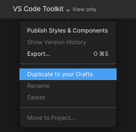

### 2. Publish Styles & Components

Next, Publish Styles & Components as a team library. You can also rename & move this file to a team project if you wish to use this with others.

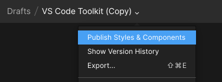

### 3. Enable Library

Create a new file and enable the team library for your file: 

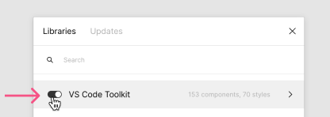

### 4. Install Icon Fonts

Install the Codicon and Seti icon fonts to use the glyphs. Make sure you reload your Figma file after you’ve installed the fonts:

Link: [Codicons](https://github.com/microsoft/vscode-codicons/blob/master/dist/codicon.ttf)

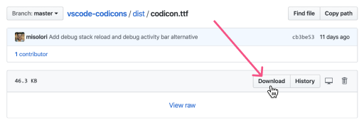

Link: [Seti](https://github.com/jesseweed/seti-ui/blob/master/styles/_fonts/seti/seti.ttf)

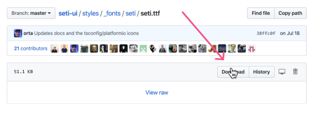

### 5. Using Components
You can now search for components using the “Assets” panel or you can go to the master library and copy components and paste them into your file.

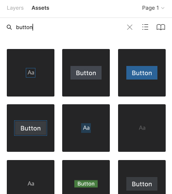

Ensure that when you paste components that they are instances:

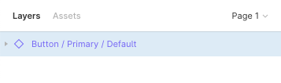

### 6. Swapping States

Most components will have various states that you can swap to, which should retain their overrides:

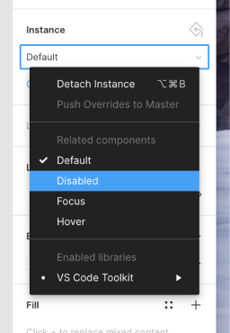

### 7. Using Icons

Use the “Visual Studio Code Icons” Figma plugin to copy icon glyphs:

Figma Plugin: [Visual Studio Code Icons](https://aka.ms/vscode-figma-icons)

### 8. Icon Styles

All icons can be replaced by pasting a glyph. Ensure that you use the correct icon style for either Codicons or Seti icons.

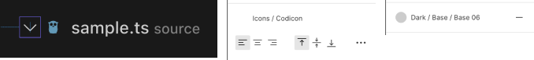

Seti icons have color styles that you can also use.

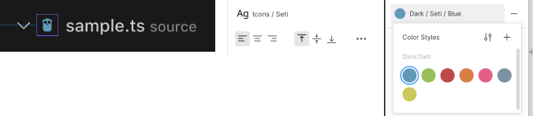

### 9. Using Templates

A quick way to get started is to copy one of the “Templates” and detach the symbol to start making edits.

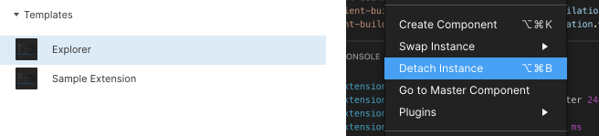

# Color Mapping

Below is a mapping of the colors that are used in the Figma to their color tokens (alpha channel in parenthesis). This only covers the default (dark) theme for now.

|Color Name|Color token|
|---|---|
|Dark 01|activityBar.dropBackground (1f)   activityBar.foreground   activityBar.inactiveForeground (99)   activityBarBadge.foreground   badge.foreground   button.foreground   editor.rangeHighlightBackground (0b)   extensionBadge.remoteForeground   extensionButton.prominentForeground   list.activeSelectionForeground   menu.selectionForeground   menubar.selectionBackground (1a)   panel.dropBackground (1f)   peekViewResult.fileForeground   peekViewResult.selectionForeground   peekViewTitleLabel.foreground   sideBar.dropBackground (1f)   statusBar.debuggingForeground   statusBar.foreground   statusBar.noFolderForeground   statusBarItem.activeBackground (2e)   statusBarItem.hoverBackground (1f)   statusBarItem.prominentForeground   statusBarItem.remoteForeground   tab.activeForeground   tab.inactiveForeground (80)   tab.unfocusedActiveForeground (80)   tab.unfocusedInactiveForeground (40)   terminal.selectionBackground (40)   textSeparator.foreground (2e)  |
|Dark 02|checkbox.foreground dropdown.foreground settings.checkboxForeground settings.dropdownForeground |
|Dark 03|panelTitle.activeForeground panelTitle.inactiveForeground (99) settings.headerForeground |
|Dark 04|terminal.ansiBrightWhite terminal.ansiWhite|
|Dark 05|editor.foreground editorSuggestWidget.foreground foreground|
|Dark 06|breadcrumb.foreground (cc) descriptionForeground (b3) editorWidget.foreground foreground input.foreground menu.foreground menubar.selectionForeground notifications.foreground peekViewTitleDescription.foreground (b3) settings.numberInputForeground settings.textInputForeground terminal.foreground titleBar.activeForeground titleBar.inactiveForeground (99) |
|Dark 07|editorActiveLineNumber.foreground editorLineNumber.activeForeground|
|Dark 08|menu.separatorBackground peekViewResult.lineForeground sideBarTitle.foreground |
|Dark 09|editorOverviewRuler.bracketMatchForeground editorOverviewRuler.selectionHighlightForeground (cc) editorOverviewRuler.wordHighlightForeground (cc) |
|Dark 10|imagePreview.border (59) panel.border (59) panelTitle.activeBorder (59) sideBarSectionHeader.background (33) terminal.border (59) |
|Dark 11|editorOverviewRuler.border (4d) textBlockQuote.background (1a) |
|Dark 12|editorOverviewRuler.commonContentForeground (66) merge.commonContentBackground (29) merge.commonHeaderBackground (66) |
|Dark 13|editorHoverWidget.border editorSuggestWidget.border editorWidget.border settings.dropdownListBorder |
|Dark 14|checkbox.background checkbox.border dropdown.background dropdown.border input.background settings.checkboxBackground settings.checkboxBorder settings.dropdownBackground settings.dropdownBorder titleBar.activeBackground titleBar.inactiveBackground (99) |
|Dark 15|editor.findRangeHighlightBackground (66) editor.inactiveSelectionBackground  |
|Dark 16|activityBar.background debugToolBar.background |
|Dark 17|notificationCenterHeader.background notifications.border |
|Dark 18|settings.numberInputBackground settings.textInputBackground |
|Dark 19|breadcrumbPicker.background editorGroupHeader.tabsBackground editorHoverWidget.background editorSuggestWidget.background editorWidget.background menu.background notifications.background peekViewResult.background quickInput.background sideBar.background tab.border |
|Dark 20|breadcrumb.background editor.background editorGroupHeader.noTabsBackground editorGutter.background editorPane.background panel.background peekViewTitle.background tab.activeBackground tab.unfocusedActiveBackground terminal.background |
|Dark 21|editorUnnecessaryCode.opacity (aa) listFilterWidget.outline (00) scrollbar.shadow statusBarItem.prominentBackground (80) statusBarItem.prominentHoverBackground (4d) terminal.ansiBlack widget.shadow |
|Blue 01|editorInfo.foreground editorMarkerNavigationInfo.background editorOverviewRuler.infoForeground |
|Blue 02|editorOverviewRuler.incomingContentForeground (80) merge.incomingContentBackground (33) merge.incomingHeaderBackground (80) |
|Blue 03|notificationLink.foreground pickerGroup.foreground textLink.activeForeground textLink.foreground |
|Blue 04|editor.hoverHighlightBackground (40) editor.selectionBackground |
|Blue 05|tab.activeModifiedBorder tab.inactiveModifiedBorder (80) tab.unfocusedActiveModifiedBorder (80) tab.unfocusedInactiveModifiedBorder (40) |
|Blue 06|editorSuggestWidget.highlightForeground list.highlightForeground |
|Blue 07|activityBarBadge.background editorOverviewRuler.addedForeground (99) editorOverviewRuler.deletedForeground (99) editorOverviewRuler.modifiedForeground (99) editorOverviewRuler.rangeHighlightForeground (99) extensionBadge.remoteBackground inputOption.activeBorder (00) inputValidation.infoBorder peekView.border statusBar.background textBlockQuote.border (80) |
|Blue 08|button.background |focusBorder (cc)inputOption.activeBackground (66) |
|Blue 09|list.activeSelectionBackground menu.selectionBackground |
|Blue 10|editorSuggestWidget.selectedBackground list.focusBackground |
|Blue 11|peekViewEditor.background peekViewEditorGutter.background |
|Red 01|editorInfo.foreground editorLightBulbAutoFix.foreground editorMarkerNavigationInfo.background editorOverviewRuler.infoForeground notificationsInfoIcon.foreground |
|Red 02|editorOverviewRuler.incomingContentForeground (80) merge.incomingContentBackground (33) merge.incomingHeaderBackground (80) |
|Red 03|notificationLink.foreground pickerGroup.foreground textLink.activeForeground textLink.foreground |
|Red 04|editor.hoverHighlightBackground (40) editor.selectionBackground minimap.selectionHighlight |
|Green 01|gitDecoration.addedResourceForeground editor.focusedStackFrameHighlightBackground gitDecoration.untrackedResourceForeground editorLink.activeForeground |
|Green 02|editorOverviewRuler.incomingContentForeground (80) merge.incomingContentBackground (33) merge.incomingHeaderBackground (80) terminal.ansiBrightGreen |
|Green 03|statusBarItem.remoteBackground editorGutter.addedBackground |
|Green 04|extensionButton.prominentBackground extensionButton.prominentHoverBackground editorBracketMatch.background |
|Purple 01|editorOverviewRuler.wordHighlightStrongForeground gitDecoration.conflictingResourceForeground |
|Purple 02|terminal.ansiMagenta terminal.ansiBrightMagenta |
|Purple 03|statusBar.noFolderBackground |
|Yellow 01|gitDecoration.modifiedResourceForeground textPreformat.foreground |
|Yellow 02|editorMarkerNavigationWarning.background editorOverviewRuler.warningForeground editorWarning.foreground list.warningForeground |
|Yellow 03|inputValidation.warningBorder list.invalidItemForeground inputValidation.warningBackground |
|Yellow 04|terminal.ansiYellow terminal.ansiBrightYellow editor.stackFrameHighlightBackground |
|Orange 01|statusBar.debuggingBackground editorOverviewRuler.findMatchForeground (7e) minimap.findMatchHighlight |
|Orange 02|peekViewEditor.matchHighlightBackground editor.findMatchHighlightBackground (55) peekViewResult.matchHighlightBackground (4d) |

# Contributing

If you'd like to contribute components, please create a PR with a link to your Figma file that has the proposed the components. Please re-use the same naming convention found in the rest of the file. Depending on the 

This project welcomes contributions and suggestions.  Most contributions require you to agree to a
Contributor License Agreement (CLA) declaring that you have the right to, and actually do, grant us
the rights to use your contribution. For details, visit https://cla.opensource.microsoft.com.

When you submit a pull request, a CLA bot will automatically determine whether you need to provide
a CLA and decorate the PR appropriately (e.g., status check, comment). Simply follow the instructions
provided by the bot. You will only need to do this once across all repos using our CLA.

This project has adopted the [Microsoft Open Source Code of Conduct](https://opensource.microsoft.com/codeofconduct/).
For more information see the [Code of Conduct FAQ](https://opensource.microsoft.com/codeofconduct/faq/) or
contact [opencode@microsoft.com](mailto:opencode@microsoft.com) with any additional questions or comments.
